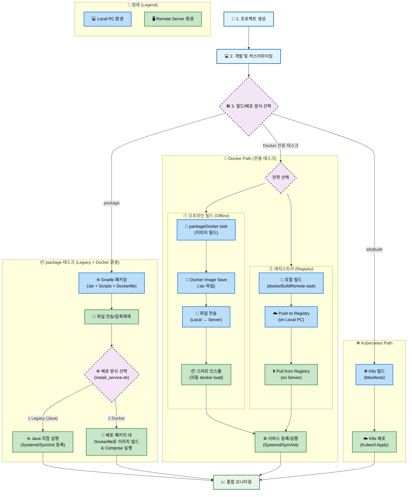
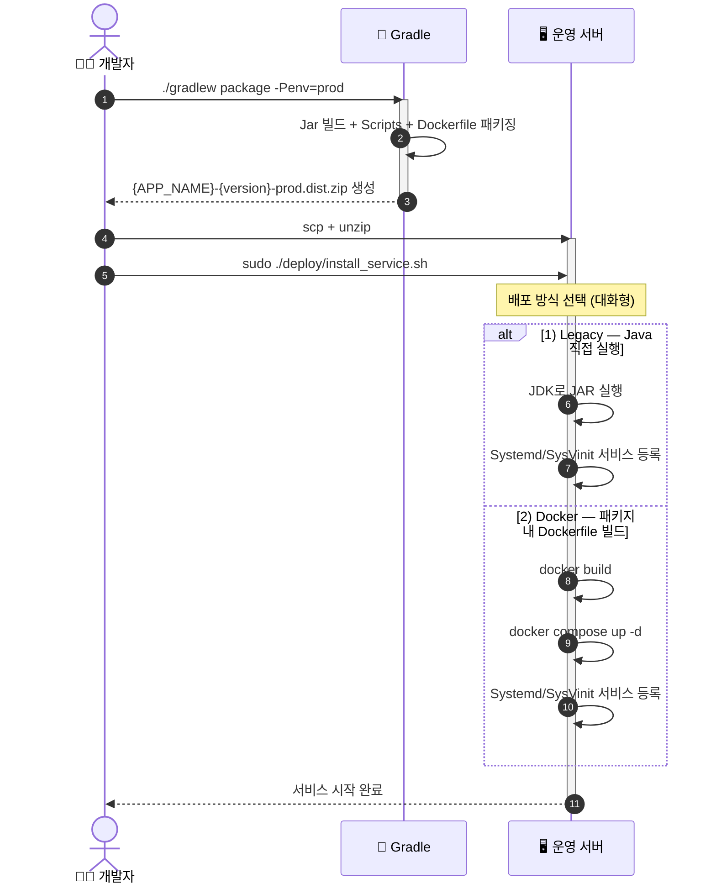
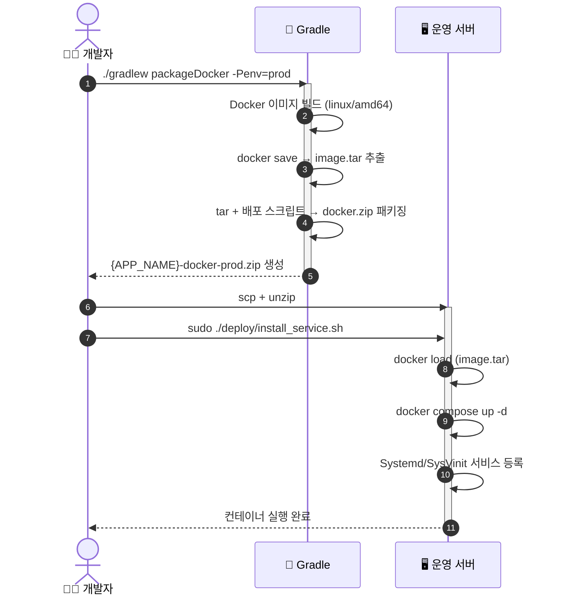
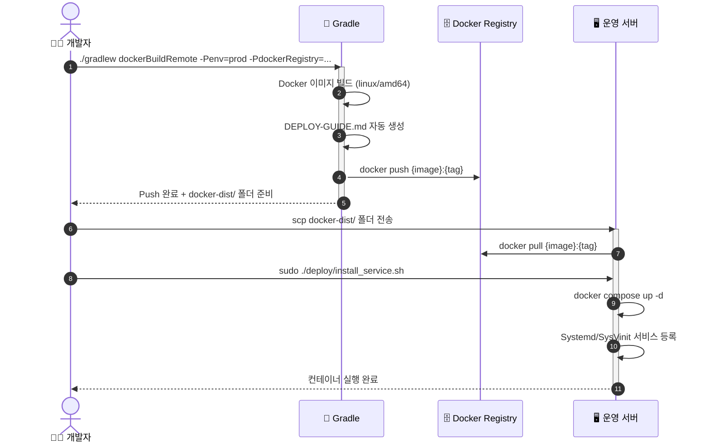
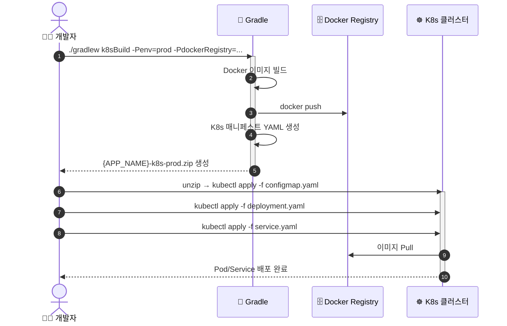

# 🛠️ Spring Boot Build & Deploy 플랫폼 개발자 및 관리자 가이드 (Maintainer Guide)

> **이 문서는 `build_template` 플랫폼 자체를 유지보수, 개발, 테스트하고, Gradle Plugin Portal 및 Maven Central에 배포(Publish)하는 개발자/관리자를 위한 가이드입니다.** ✨  
> _(일반 Spring Boot 애플리케이션 개발자는 [**사용자 메인 README**](README.md)를 참고하세요.)_

---

## 🏗️ 1. 플랫폼 아키텍처 및 설계 로직

이 저장소는 **Gradle 플러그인**과 **Maven 플러그인**을 한 곳에서 개발 및 관리하는 멀티 모듈 구조를 채택하고 있습니다.

```text
build_template (루트 / SSOT)
├── 📁 scripts/                  # ⭐️ 유일한 마스터 스크립트 원본 (SSOT)
│   ├── deploy/                 # install_service.sh, uninstall_service.sh
│   ├── service/                # start.sh, stop.sh, status.sh, cron/
│   └── common/                 # bootstrap.sh, utils.sh, run_bash_tests.sh
├── 📁 docker/                   # ⭐️ 유일한 마스터 Docker 원본 (SSOT)
│   ├── Dockerfile
│   ├── docker-compose.yml
│   ├── dev/
│   └── prod/
├── 📁 distribution-gradle-plugin/ # 🐘 Gradle 배포 플러그인 모듈
│   └── src/main/java/io/github/mj_youn/plugin/DistributionPlugin.java
├── 📁 distribution-maven-plugin/  # 🪶 Maven 배포 플러그인 모듈
│   ├── src/main/java/io/github/mj_youn/plugin/
│   │   ├── DistributionMojo.java (package goal)
│   │   ├── DeployMojo.java       (deploy goal)
│   │   └── HelpMojo.java         (help goal)
│   └── src/main/resources/META-INF/maven/plugin.xml
├── build.gradle                 # 루트 빌드 스크립트 (원클릭 동시 배포 태스크)
└── settings.gradle              # 서브모듈 선언
```

### 🔄 단일 원본(SSOT) 자동 동기화 원리

- 배포 스크립트와 Docker 템플릿의 소스는 오직 루트 디렉토리(`/scripts`, `/docker`)에만 존재합니다.
- 각 서브모듈의 `build.gradle`에 정의된 `processResources` 태스크가 플러그인 빌드 시점에 루트의 마스터 자원을 플러그인 JAR의 `resources/dist-template/` 내부로 자동 복사합니다.
- 따라서 스크립트 수정 시 루트의 파일 하나만 수정하면 Gradle 및 Maven 플러그인에 동시에 최신 코드가 반영됩니다.

### ⚙️ Maven Plugin 디스크립터 (`plugin.xml`)의 역할

Maven 플러그인은 컴파일 시점에 플러그인 디스크립터(`META-INF/maven/plugin.xml`)를 참조하여 Goal과 매개변수를 바인딩합니다:

- `mvn distribution:package` ➡️ `DistributionMojo`
- `mvn distribution:deploy` ➡️ `DeployMojo`
- `mvn distribution:help` ➡️ `HelpMojo`
- `<project default-value="${project}"/>` 선언을 통해 Maven 런타임의 `MavenProject` 인스턴스를 주입받습니다.

---

## 🧪 2. 로컬 빌드 및 테스트 가이드

### 사전 환경 조건

- **JDK Requirement**: **Java 25** 이상
    - Maven 실행 환경 등에서 Java 8/17이 기본으로 잡혀있는 경우 `UnsupportedClassVersionError`가 발생할 수 있으므로 항상 Java 25 `JAVA_HOME`을 지정하여 실행합니다.

```bash
export JAVA_HOME=/Library/Java/JavaVirtualMachines/temurin-25.jdk/Contents/Home
```

### 1) 서브모듈 컴파일 및 로컬 배포 (`publishToMavenLocal`)

로컬 테스트를 위해 로컬 Maven 캐시(`~/.m2/repository`)에 두 플러그인을 설치합니다:

```bash
# 🐘 Gradle 플러그인 로컬 빌드 및 설치
./gradlew :distribution-gradle-plugin:publishToMavenLocal

# 🪶 Maven 플러그인 로컬 빌드 및 설치
./gradlew :distribution-maven-plugin:publishToMavenLocal
```

### 2) 로컬 샘플 프로젝트에서 플러그인 동작 검증

- **Gradle 테스트**: 테스트 프로젝트의 `settings.gradle`에 `mavenLocal()`을 선언한 뒤 `./gradlew package -Penv=dev` 및 `./gradlew deployService -Penv=dev` 실행.
- **Maven 테스트**: 테스트 프로젝트의 `pom.xml`에 `pluginRepositories`로 `local-maven`을 지정한 뒤 `mvn clean package -Denv=dev` 및 `mvn distribution:deploy -Denv=dev` 실행.
- **파일 단위 @Override 테스트**: 테스트 프로젝트 내에 `scripts/service/start.sh`를 커스텀 작성 후 빌드 시 Zip 내에 커스텀 파일이 우선 패키징되는지 확인.

---

## 🚀 3. 공식 저장소 릴리즈 및 원클릭 동시 배포

### 1) 사전 배포 인증 설정

#### ① Gradle Plugin Portal 인증키 설정 (`~/.gradle/gradle.properties`)

```properties
gradle.publish.key=발급받은_GRADLE_PORTAL_KEY
gradle.publish.secret=발급받은_GRADLE_PORTAL_SECRET
```

#### ② Maven Central (Sonatype Central Portal) 인증키 설정 (`~/.gradle/gradle.properties`)

```properties
centralUsername=발급받은_CENTRAL_PORTAL_TOKEN_USERNAME
centralPassword=발급받은_CENTRAL_PORTAL_TOKEN_PASSWORD
```

---

### 2) 🌐 퍼블릭 공식 배포 명령어 가이드

저장소 루트 디렉토리에서 아래 명령을 통해 개별 배포 또는 원클릭 동시 배포를 수행할 수 있습니다:

#### ① Gradle 플러그인 배포 (`Gradle Plugin Portal`)
```bash
JAVA_HOME=/Library/Java/JavaVirtualMachines/temurin-25.jdk/Contents/Home ./gradlew publishGradlePlugins
```
- **저장소**: [Gradle Plugin Portal](https://plugins.gradle.org/plugin/io.github.mj-youn.distribution)

#### ② Maven 플러그인 배포 (`Sonatype Central Portal`)
```bash
JAVA_HOME=/Library/Java/JavaVirtualMachines/temurin-25.jdk/Contents/Home ./gradlew publishMavenPlugins
```
- **저장소**: [Sonatype Central Portal](https://central.sonatype.com/)

#### ③ 두 플러그인 원클릭 동시 배포 (One-Click Publish All)
```bash
JAVA_HOME=/Library/Java/JavaVirtualMachines/temurin-25.jdk/Contents/Home ./gradlew publishAllPlugins
```

## 📌 버전 업데이트 정책

플러그인 기능 추가나 스크립트 수정 시 다음 파일들의 버전을 일치시켜 함께 갱신합니다:

1. `distribution-gradle-plugin/build.gradle` (`version = 'x.y.z'`)
2. `distribution-maven-plugin/build.gradle` (`version = 'x.y.z'`)
3. `distribution-maven-plugin/src/main/resources/META-INF/maven/plugin.xml` (`<version>x.y.z</version>`)
4. 루트 `README.md`, 서브모듈 `README.md` 문서 내 버전 표기

---

## 🧜‍♀️ 배포 워크플로우 (Workflow)



## 🧜‍♀️ 배포 시퀀스 (Sequence Diagram)

### 📦 Legacy 배포 (`./gradlew package`)



### 🐳 Docker 배포 (2가지 전용 전략 + 1 통합 배포)

Docker 전용 태스크는 주로 **어디서 빌드하고 어떻게 서버에 배포할 것인가(네트워크 및 인프라 환경)**에 따라 나뉩니다. 다음 표를 참고하여 환경에 맞는 방식을 선택하세요.

|      구분       | Strategy 1: `packageDocker`                     | Strategy 2: `dockerBuildRemote`                               | (참고) 통합 배포: `package`                |
| :-------------: | :---------------------------------------------- | :------------------------------------------------------------ | :----------------------------------------- |
|  **핵심 목적**  | 외부 서버 전송을 위한 **단일 Zip 패키지 생성**  | 원격 저장소를 활용한 **표준 파이프라인 구성**                 | 배포 서버에서 런타임에 직접 실행 방식 선택 |
|  **타겟 환경**  | 인터넷/레지스트리 접근이 불가한 **폐쇄망 환경** | AWS ECR, Docker Hub 등 **원격 레지스트리 환경**               | 서버에서 소스를 클론받아 바로 띄우는 환경  |
|  **작업 내용**  | 이미지 빌드 + `.tar` 추출 + Zip 파일 압축       | 이미지 빌드 + 원격 레지스트리로 `docker push`                 | Jar 빌드 + Dockerfile + 스크립트 압축      |
| **주요 산출물** | `build/dist/...-docker-prod.zip`                | Remote Registry에 업로드된 Docker Image                       | `build/dist/...-prod.dist.zip`             |
|  **전송 방식**  | 수동 전송 필요 (Zip 파일을 복사)                | 자동 풀 (운영 서버에서 `docker pull`로 수신)                  | 소스 pull 또는 Zip 복사                    |
|  **실행 예시**  | `./gradlew packageDocker -Penv=prod`            | `./gradlew dockerBuildRemote -Penv=prod -PdockerRegistry=...` | `./gradlew package -Penv=prod`             |

#### Strategy 1 — 오프라인 빌드 (Offline Image) (`./gradlew packageDocker`)



#### Strategy 2 — Registry Push & Pull (`./gradlew dockerBuildRemote`)



### [지원 예정] ☸️ Kubernetes 배포 (`./gradlew k8sBuild`)


