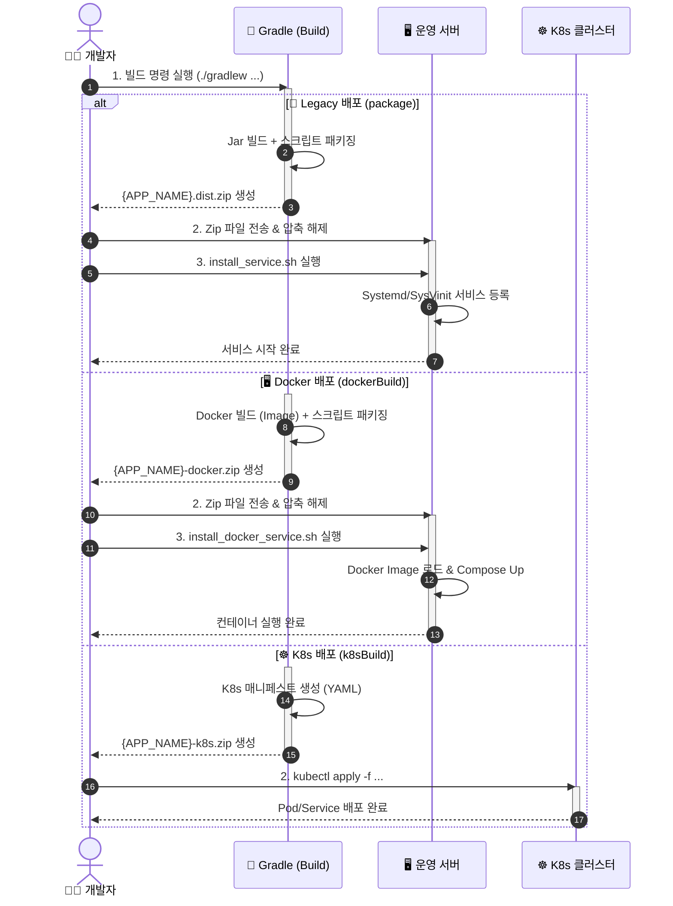

# 🚀 Spring Boot Build & Deploy Template

> **이 프로젝트는 Spring Boot 애플리케이션의 빌드 및 배포 환경을 표준화하기 위한 Boilerplate(템플릿) 프로젝트입니다.**  
> 자체 비즈니스 로직보다는 **안정적인 빌드 파이프라인**, **환경별 설정 관리(Overlay)**, **자동화된 배포 스크립트** 제공에 초점을 맞추고 있습니다.

---

## 🏗️ 프로젝트 개요 (Overview)

이 템플릿은 다음과 같은 강력한 배포 기능을 기본 제공합니다:

1.  **📦 이원화된 패키징 전략**:
    - **일반 배포**: Jar + Config + Scripts가 포함된 Zip 패키지.
    - **Docker 배포**: Image(tar) + Docker Compose + Script가 통합된 Zip 패키지.
2.  **🎨 환경별 덮어쓰기 (Overlay Build)**:
    - 기본 설정(`bin/`, `config/`) 위에 환경별 파일(`bin/prod/`, `config/prod/`)을 덮어쓰는 구조.
    - 소스 코드 변경 없이 파일 추가만으로 환경별 커스터마이징 가능.
3.  **🪵 동적 로그 경로 설정**:
    - 빌드 시점(`bin/.app-env.properties`) 또는 배포 시점(사용자 입력)에 로그 경로 설정 가능.
4.  **🐧 Linux 서비스 자동 등록**:
    - `Systemd`, `SysVinit` 자동 감지 및 서비스 등록/시작.

---

## 🛠️ 사용 가이드 (How to Use)
 
 이 프로젝트는 초기 설정을 자동화하는 스크립트(`init.sh`)를 제공합니다.
 
 ### 🚀 1단계: 프로젝트 초기화 (필수!)
 
 프로젝트 루트에 있는 `init.sh` 스크립트를 실행하여 **프로젝트 이름**, **그룹 이름**, **포트 번호**를 한 번에 설정하세요.
 
 ```bash
 ./init.sh
 ```
 
 - **자동 수행 작업**:
   - `Project Name` 변경 (`settings.gradle`)
   - `Group Name` 변경 (`build.gradle`) 및 **패키지 구조 재구성 (폴더 이동)**
   - `Server Port` 설정 (`application.yml`)
   - `Java Package` 및 `Import` 구문 일괄 수정
   - 완료 후 스크립트 자동 삭제
 
 ### 2단계: 비즈니스 로직 개발
 
 `src/main/java/{Group}/{Project}` 경로에 여러분만의 코드를 작성하세요!
 
 ---
 
 ## 📦 빌드 및 배포 (Build & Deploy)
 
 ### 🐳 Docker 배포 1: 로컬 빌드 (Standard)
 
 **"로컬 빌드 -> 이미지 추출 -> 서버 전송 -> 로드 & 실행"** 전략을 사용합니다.
 서버에 소스 코드를 올리거나 빌드 도구를 설치할 필요가 없어 보안과 관리가 용이합니다.
 
 **1. 빌드 (Development PC)**
 
 ```bash
 # 운영(prod) 환경 배포용 패키지 생성
 ./gradlew dockerBuild -Penv=prod
 ```
 
 - **결과물**: `build/dist/{APP_NAME}-docker-prod.zip`
 - **포함 내용**:
   - `image.tar`: Docker 이미지 (linux/amd64)
   - `docker-compose.yml`: 실행 설정
   - `install_docker_service.sh`: 서비스 등록/실행 스크립트
   - `uninstall_docker_service.sh`: 서비스 제거 스크립트
   - `.app-env.properties`: 환경 변수
 
 **2. 배포 (Production Server)**
 
 ```bash
 # 1. 파일 전송 (scp 등)
 scp build/dist/{APP_NAME}-docker-prod.zip user@server:/home/user/
 
 # 2. 서버 접속 후 압축 해제 및 설치
 unzip {APP_NAME}-docker-prod.zip -d deploy
 cd deploy
 sudo ./install_docker_service.sh
 ```
 
 - **자동 수행**:
   - Docker 이미지 로드 (`docker load`)
   - Docker Compose 실행 (`docker-compose up -d`)
   - Linux 서비스(Systemd) 등록 (재부팅 시 자동 실행)
 
 ### 🐳 Docker 배포 2: 서버 빌드 (Source Transfer)
 
 **"소스 전송 -> 서버 빌드 -> 실행"** 전략을 사용합니다.
 빌드 결과물(Image)을 전송하는 과정이 생략되어 네트워크 대역폭을 절약할 수 있으며, 수정 사항을 빠르게 반영할 수 있습니다.
 
 **1. 소스 전송 (Development PC -> Server)**
 
 Github 등을 통해 소스 코드를 서버로 내려받습니다.
 
 ```bash
 git clone https://github.com/my-repo/my-project.git
 cd my-project
 ```
 
 **2. 빌드 및 실행 (Server)**
 
 ```bash
 # 1. Docker 이미지 빌드 (이미지를 로컬 데몬에 생성)
 ./gradlew dockerBuildImage -Penv=prod
 
 # 2. 생성된 배포 디렉토리로 이동
 cd build/docker-dist
 
 # 3. 컨테이너 실행 (단순 실행)
 docker-compose up -d
 
 # 4. (선택) 서비스 등록 및 실행 (운영 환경 권장)
 # Systemd 서비스 등록, 로그 설정, 재부팅 시 자동 실행 등을 지원합니다.
 sudo ./install_docker_service.sh
 ```
 
 > 💡 **Tip**: 반복 배포 시 `git pull && ./gradlew dockerBuildImage -Penv=prod` 명령으로 빠르게 최신화할 수 있습니다.
 
 ### 🐳 Docker 배포 3: 레지스트리 (Push & Pull)
 
 **"Local/CI 빌드 -> Registry Push -> Server Pull -> 실행"** 전략을 사용합니다.
 Docker Hub, ECR, GCR 등 원격 레지스트리를 활용하는 표준적인 방식입니다.
 
 **1. 빌드 및 Push (Development PC / CI)**
 
 ```bash
 # 레지스트리 주소를 지정하여 빌드 및 Push
 ./gradlew dockerPushImage -Penv=prod -PdockerRegistry=my-registry.com/repo
 
 # (선택) 태그 지정 가능 (기본값: latest)
 # ./gradlew dockerPushImage -Penv=prod -PdockerRegistry=... -PdockerImageTag=v1.0.0
 ```
 
 - **결과물**:
   - Docker Registry에 이미지 업로드 (`my-registry.com/repo/{APP_NAME}:latest`)
   - `build/docker-dist`: 실행에 필요한 파일들 (`docker-compose.yml`, 스크립트 등)
 
 **2. 배포 (Server)**
 
 서버에는 **`build/docker-dist` 폴더의 내용물만** 있으면 됩니다. (소스 코드 불필요)
 CI/CD 파이프라인을 통해 설정 파일만 배포하거나, scp로 전송하세요.
 
 ```bash
 # 1. 배포 디렉토리로 이동
 cd docker-dist
 
 # 2. 컨테이너 실행 (이미지는 레지스트리에서 자동 Pull)
 docker-compose up -d
 
 # 3. (선택) 서비스 등록
 sudo ./install_docker_service.sh
 ```
 
 > ⚠️ **주의**: Private Registry를 사용하는 경우, 서버에서 `docker login`이 선행되어야 합니다.
 
 ### 🖥️ 일반 서버 배포 (Legacy)
 
 Docker 없이 Java(JDK)만 설치된 서버에 배포하는 방식입니다.
 
 **1. 빌드 (Development PC)**
 
 ```bash
 ./gradlew package -Penv=prod
 ```
 
 - **결과물**: `build/dist/{APP_NAME}-{version}-prod.dist.zip`
 
 **2. 배포 (Server)**
 
 ```bash
 # 압축 해제 후 설치 스크립트 실행
 unzip {APP_NAME}-*.dist.zip -d {APP_NAME}
 cd {APP_NAME}
 sudo ./bin/install_service.sh
 ```

### ☸️ Kubernetes 배포 (K8s) (개발 예정)

Docker 배포를 넘어, Kubernetes 환경을 위한 매니페스트(`yaml`)도 자동으로 생성해줍니다.

**1. 빌드 (Development PC)**

```bash
# K8s 배포 패키지 생성 (Docker 빌드도 포함됨)
./gradlew k8sBuild -Penv=prod
```

- **결과물**: `build/dist/{APP_NAME}-k8s-prod.zip`
- **내용**: `deployment.yaml`, `service.yaml`, `configmap.yaml` (프로젝트 이름 자동 적용됨)

**2. 배포 (K8s Cluster)**

```bash
# 압축 해제
unzip {APP_NAME}-k8s-prod.zip -d k8s-deploy
cd k8s-deploy/k8s

# 클러스터에 적용
kubectl apply -f configmap.yaml
kubectl apply -f deployment.yaml
kubectl apply -f service.yaml
```

---

## ✅ 배포 검증 (Verification)

배포가 정상적으로 완료되었는지 확인하는 3단계 루틴입니다.

### 1. 프로세스 및 포트 확인

서비스가 실행 중이고 포트(8080)가 열려있는지 확인합니다.

```bash
# 🐳 Docker 배포 시
docker ps | grep my-service

# 🖥️ 일반 배포 시
ps -ef | grep java
# 또는
netstat -anlp | grep :8080
```

### 2. 로그 확인 (필수)

애플리케이션이 에러 없이 부팅되었는지 로그를 확인하세요.
`Started Application` 문구가 보이면 성공입니다.

```bash
# 🐳 Docker 배포 시
docker logs -f my-service-app

# 🖥️ 일반 배포 시 (편의 스크립트)
tail-log-my-service.sh
```

### 3. API 응답 확인 (e.g. Health Check)

실제로 요청을 보내 응답이 오는지 테스트합니다.

```bash
# 로컬에서 테스트
curl -v http://localhost:8080/

# 응답 예시
# < HTTP/1.1 200 OK ...
```

---

## 🎨 고급 설정: 환경별 빌드 (Overlay)

`bin`과 `config` 폴더는 **"덮어쓰기 전략"** 을 따릅니다.
환경별로 다른 설정이 필요하면, `prod` 폴더를 만들고 파일을 넣으세요.

| 경로                           | 역할                              | 우선순위                            |
| ------------------------------ | --------------------------------- | ----------------------------------- |
| `bin/prod/.app-env.properties` | **운영 환경 전용** (로그 경로 등) | 🥇 1순위 (Zip에 이 파일이 덮어써짐) |
| `bin/.app-env.properties`      | **공통 기본값**                   | 🥈 2순위                            |

**예시: 운영 서버 로그 경로 변경**

1. `bin/prod/.app-env.properties` 생성
2. 내용 작성: `LOG_PATH="/var/log/my-service"`
3. `./gradlew package -Penv=prod` 실행 시 자동으로 적용됨.

---

## 🧜‍♀️ 개발 워크플로우 (Workflow)


## 🧜‍♀️ 개발 시퀀스 (Sequence Diagram)


