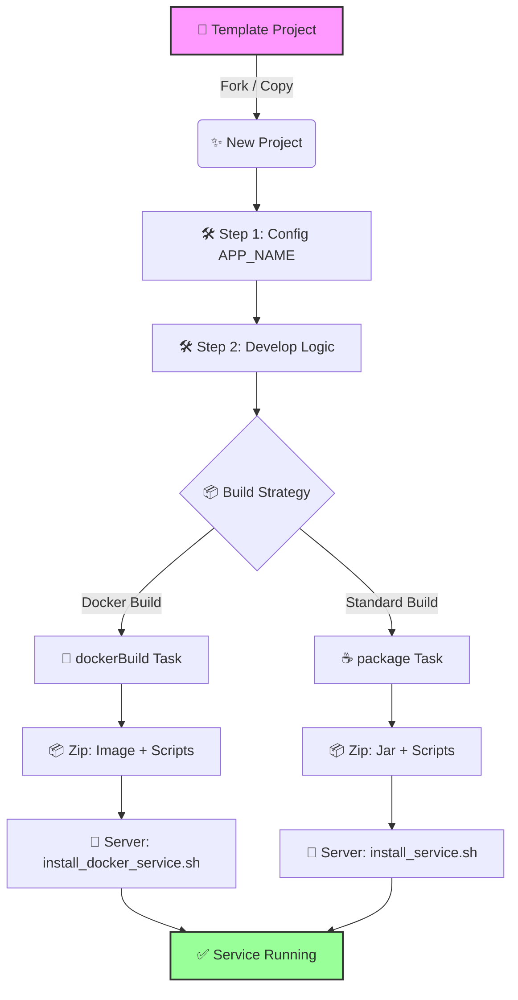

# 🚀 Spring Boot Build & Deploy Template

> **이 프로젝트는 Spring Boot 애플리케이션의 빌드 및 배포 환경을 표준화하기 위한 Boilerplate(템플릿) 프로젝트입니다.**  
> 자체 비즈니스 로직보다는 **안정적인 빌드 파이프라인**, **환경별 설정 관리(Overlay)**, **자동화된 배포 스크립트** 제공에 초점을 맞추고 있습니다.

---

## 🏗️ 프로젝트 개요 (Overview)

이 템플릿은 다음과 같은 강력한 배포 기능을 기본 제공합니다:

1.  **📦 이원화된 패키징 전략**:
    - **일반 배포**: Jar + Config + Scripts가 포함된 Zip 패키지.
    - **Docker 배포**: Image(tar) + Docker Compose + Script가 통합된 Zip 패키지.
2.  **🎨 환경별 덮어쓰기 (Overlay Build)**:
    - 기본 설정(`bin/`, `config/`) 위에 환경별 파일(`bin/prod/`, `config/prod/`)을 덮어쓰는 구조.
    - 소스 코드 변경 없이 파일 추가만으로 환경별 커스터마이징 가능.
3.  **🪵 동적 로그 경로 설정**:
    - 빌드 시점(`bin/.app-env.properties`) 또는 배포 시점(사용자 입력)에 로그 경로 설정 가능.
4.  **🐧 Linux 서비스 자동 등록**:
    - `Systemd`, `SysVinit` 자동 감지 및 서비스 등록/시작.

---

## 🛠️ 사용 가이드 (How to Use)

이 프로젝트를 Fork하거나 복사하여 새로운 서비스를 만들 때, 다음 4단계만 수정하면 됩니다.

### 1단계: 프로젝트 이름 설정 (필수!)
가장 중요합니다. 이 이름이 `서비스명`, `로그파일명`, `Docker이미지명`이 됩니다.

- **파일**: `settings.gradle`
```groovy
rootProject.name = 'my-awesome-service' // 👈 여기에 원하는 이름 입력
```

### 2단계: 패키지 및 그룹명 변경
- **파일**: `build.gradle`
```groovy
group = 'com.mycompany.service' // 👈 팀/회사 도메인으로 변경
version = '1.0.0'
```
- **폴더 변경 (Package Structure)**:
  `group` 설정에 맞춰 소스 폴더를 변경합니다. 보통 `group` + `rootProject.name` 조합을 사용하지만, **반드시 프로젝트 이름과 같을 필요는 없습니다.**
    - **권장 (Standard)**: `src/main/java/{group}/{rootProject.name}`
        - 예: `src/main/java/com/mycompany/service/myawesomeservice`
    - **심플 (Simple)**: `src/main/java/{group}`
        - 예: `src/main/java/com/mycompany/service`

### 3단계: 포트 및 기본 설정
- **파일**: `config/application.yml`
```yaml
server:
  port: 8080 # 👈 충돌하지 않는 포트로 변경
spring:
  application:
    name: my-awesome-service # 👈 (선택 사항) Spring 내부 식별용 이름
```
> 💡 **참고**: `spring.application.name`은 Spring Cloud나 로깅 등 내부 식별용이며, **빌드되는 파일명(`rootProject.name`)과는 달라도 상관없습니다.**

### 4단계: 비즈니스 로직 개발
이제 `src/main/java`에 여러분만의 코드를 작성하세요!

---

## 📦 빌드 및 배포 (Build & Deploy)

### 🅰️ Docker 배포 (추천)
서버에 Docker가 설치되어 있다면 가장 간편하고 깔끔한 방법입니다.

**1. 빌드 (Development PC)**
```bash
# 운영(prod) 환경 배포용 빌드
./gradlew dockerBuild -Penv=prod
```
- **결과물**: `build/dist/{APP_NAME}-docker-prod.zip`
- **내용**: `image.tar`, `docker-compose.yml`, `install_docker_service.sh`

**2. 배포 (Server)**
```bash
# 압축 해제 후 스크립트 실행
unzip {APP_NAME}-docker-prod.zip -d deploy
cd deploy
sudo ./install_docker_service.sh
```
- **자동 수행**: Docker 이미지 로드 -> 서비스 등록 -> 실행

### 🅱️ 일반 서버 배포 (Legacy)
Docker 없이 Java만 설치된 서버에 직접 배포합니다.

**1. 빌드 (Development PC)**
```bash
./gradlew package -Penv=prod
```
- **결과물**: `build/dist/{APP_NAME}-{version}-prod.dist.zip`

**2. 배포 (Server)**
```bash
# 압축 해제 후 스크립트 실행
unzip {APP_NAME}-*.dist.zip -d {APP_NAME}
cd {APP_NAME}
sudo ./bin/install_service.sh
```

---

## 🎨 고급 설정: 환경별 빌드 (Overlay)

`bin`과 `config` 폴더는 **"덮어쓰기 전략"**을 따릅니다.
환경별로 다른 설정이 필요하면, `prod` 폴더를 만들고 파일을 넣으세요.

| 경로 | 역할 | 우선순위 |
|---|---|---|
| `bin/prod/.app-env.properties` | **운영 환경 전용** (로그 경로 등) | 🥇 1순위 (Zip에 이 파일이 덮어써짐) |
| `bin/.app-env.properties` | **공통 기본값** | 🥈 2순위 |

**예시: 운영 서버 로그 경로 변경**
1. `bin/prod/.app-env.properties` 생성
2. 내용 작성: `LOG_PATH="/var/log/my-service"`
3. `./gradlew package -Penv=prod` 실행 시 자동으로 적용됨.

---

## 🧜‍♀️ 개발 워크플로우 (Workflow)


