# 🚀 Spring Boot Build & Deploy Template

> **이 프로젝트는 Spring Boot 애플리케이션의 빌드 및 배포 환경을 표준화하기 위한 Boilerplate(템플릿) 프로젝트입니다.**  
> 자체 비즈니스 로직보다는 **안정적인 빌드 파이프라인**, **환경별 설정 관리(Overlay)**, **자동화된 배포 스크립트** 제공에 초점을 맞추고 있습니다.

---

## 🏗️ 프로젝트 개요 (Overview)

이 템플릿은 다음과 같은 강력한 배포 기능을 기본 제공합니다:

1.  **📦 이원화된 패키징 전략**:
    - **일반 배포**: Jar + Config + Scripts가 포함된 Zip 패키지.
    - **Docker 배포**: Image(tar) + Docker Compose + Script가 통합된 Zip 패키지.
2.  **🎨 환경별 덮어쓰기 (Overlay Build)**:
    - 기본 설정(`bin/`, `config/`) 위에 환경별 파일(`bin/prod/`, `config/prod/`)을 덮어쓰는 구조.
    - 소스 코드 변경 없이 파일 추가만으로 환경별 커스터마이징 가능.
3.  **🪵 동적 로그 경로 설정**:
    - 빌드 시점(`bin/.app-env.properties`) 또는 배포 시점(사용자 입력)에 로그 경로 설정 가능.
4.  **🐧 Linux 서비스 자동 등록**:
    - `Systemd`, `SysVinit` 자동 감지 및 서비스 등록/시작.

---

## 🛠️ 사용 가이드 (How to Use)

이 프로젝트를 Fork하거나 복사하여 새로운 서비스를 만들 때, 다음 4단계만 수정하면 됩니다.

### 1단계: 프로젝트 이름 설정 (필수!)

가장 중요합니다. 이 이름이 `서비스명`, `로그파일명`, `Docker이미지명`이 됩니다.

- **파일**: `settings.gradle`

```groovy
rootProject.name = 'my-awesome-service' // 👈 여기에 원하는 이름 입력
```

### 2단계: 패키지 및 그룹명 변경

- **파일**: `build.gradle`

```groovy
group = 'com.mycompany.service' // 👈 팀/회사 도메인으로 변경
version = '1.0.0'
```

- **폴더 변경 (Package Structure)**:
  `group` 설정에 맞춰 소스 폴더를 변경합니다. 보통 `group` + `rootProject.name` 조합을 사용하지만, **반드시 프로젝트 이름과 같을 필요는 없습니다.**
    - **권장 (Standard)**: `src/main/java/{group}/{rootProject.name}`
        - 예: `src/main/java/com/mycompany/service/myawesomeservice`
    - **심플 (Simple)**: `src/main/java/{group}`
        - 예: `src/main/java/com/mycompany/service`

### 3단계: 포트 및 기본 설정

- **파일**: `config/application.yml`

```yaml
server:
    port: 8080 # 👈 충돌하지 않는 포트로 변경
spring:
    application:
        name: my-awesome-service # 👈 (선택 사항) Spring 내부 식별용 이름
```

> 💡 **참고**: `spring.application.name`은 Spring Cloud나 로깅 등 내부 식별용이며, **빌드되는 파일명(`rootProject.name`)과는 달라도 상관없습니다.**

### 4단계: 비즈니스 로직 개발

이제 `src/main/java`에 여러분만의 코드를 작성하세요!

---

## 📦 빌드 및 배포 (Build & Deploy)

### 🐳 Docker 배포 (추천)

서버에 Docker가 설치되어 있다면 가장 간편하고 깔끔한 방법입니다.

**1. 빌드 (Development PC)**

```bash
# 운영(prod) 환경 배포용 빌드
./gradlew dockerBuild -Penv=prod
```

- **결과물**: `build/dist/{APP_NAME}-docker-prod.zip`
- **내용**: `image.tar`, `docker-compose.yml`, `install_docker_service.sh`

**2. 배포 (Server)**

```bash
# 압축 해제 후 스크립트 실행
unzip {APP_NAME}-docker-prod.zip -d deploy
cd deploy
sudo ./install_docker_service.sh
```

- **자동 수행**: Docker 이미지 로드 -> 서비스 등록 -> 실행

### 🖥️ 일반 서버 배포 (Legacy)

Docker 없이 Java만 설치된 서버에 직접 배포합니다.

**1. 빌드 (Development PC)**

```bash
./gradlew package -Penv=prod
```

- **결과물**: `build/dist/{APP_NAME}-{version}-prod.dist.zip`

**2. 배포 (Server)**

```bash
# 압축 해제 후 스크립트 실행
unzip {APP_NAME}-*.dist.zip -d {APP_NAME}
cd {APP_NAME}
sudo ./bin/install_service.sh
```

### ☸️ Kubernetes 배포 (K8s)

Docker 배포를 넘어, Kubernetes 환경을 위한 매니페스트(`yaml`)도 자동으로 생성해줍니다.

**1. 빌드 (Development PC)**

```bash
# K8s 배포 패키지 생성 (Docker 빌드도 포함됨)
./gradlew k8sBuild -Penv=prod
```

- **결과물**: `build/dist/{APP_NAME}-k8s-prod.zip`
- **내용**: `deployment.yaml`, `service.yaml`, `configmap.yaml` (프로젝트 이름 자동 적용됨)

**2. 배포 (K8s Cluster)**

```bash
# 압축 해제
unzip {APP_NAME}-k8s-prod.zip -d k8s-deploy
cd k8s-deploy/k8s

# 클러스터에 적용
kubectl apply -f configmap.yaml
kubectl apply -f deployment.yaml
kubectl apply -f service.yaml
```

---

## ✅ 배포 검증 (Verification)

배포가 정상적으로 완료되었는지 확인하는 3단계 루틴입니다.

### 1. 프로세스 및 포트 확인

서비스가 실행 중이고 포트(8080)가 열려있는지 확인합니다.

```bash
# 🐳 Docker 배포 시
docker ps | grep my-service

# 🖥️ 일반 배포 시
ps -ef | grep java
# 또는
netstat -anlp | grep :8080
```

### 2. 로그 확인 (필수)

애플리케이션이 에러 없이 부팅되었는지 로그를 확인하세요.
`Started Application` 문구가 보이면 성공입니다.

```bash
# 🐳 Docker 배포 시
docker logs -f my-service-app

# 🖥️ 일반 배포 시 (편의 스크립트)
tail-log-my-service.sh
```

### 3. API 응답 확인 (e.g. Health Check)

실제로 요청을 보내 응답이 오는지 테스트합니다.

```bash
# 로컬에서 테스트
curl -v http://localhost:8080/

# 응답 예시
# < HTTP/1.1 200 OK ...
```

---

## 🎨 고급 설정: 환경별 빌드 (Overlay)

`bin`과 `config` 폴더는 **"덮어쓰기 전략"** 을 따릅니다.
환경별로 다른 설정이 필요하면, `prod` 폴더를 만들고 파일을 넣으세요.

| 경로                           | 역할                              | 우선순위                            |
| ------------------------------ | --------------------------------- | ----------------------------------- |
| `bin/prod/.app-env.properties` | **운영 환경 전용** (로그 경로 등) | 🥇 1순위 (Zip에 이 파일이 덮어써짐) |
| `bin/.app-env.properties`      | **공통 기본값**                   | 🥈 2순위                            |

**예시: 운영 서버 로그 경로 변경**

1. `bin/prod/.app-env.properties` 생성
2. 내용 작성: `LOG_PATH="/var/log/my-service"`
3. `./gradlew package -Penv=prod` 실행 시 자동으로 적용됨.

---

## 🧜‍♀️ 개발 워크플로우 (Workflow)

```mermaid
flowchart TD
    Start["🚀 1. 프로젝트 생성"] --> Dev["💻 2. 개발 및 커스터마이징"]
    Dev --> BuildSelect{"🛠️ 3. 빌드/배포 방식 선택"}

    %% 서브그래프: Legacy
    subgraph Legacy ["🐳 Legacy Path (Jar)"]
        direction TB
        LegacyBuild["☕ Gradle 패키징<br/>(Jar + Scripts)"]
        LegacyBuild --> LegacyTrans["📂 파일 전송/압축해제"]
        LegacyTrans --> LegacyDeploy["⚙️ 서비스 등록/실행<br/>(Systemd/SysVinit)"]
    end

    %% 서브그래프: Docker Strategies
    subgraph Docker ["🖥️ Docker Path"]
        direction TB
        DockerDecide{"전략 선택"}
        
        %% Strategy 1: Local Image
        subgraph DockerOpt1 ["① 로컬 빌드 + 전송"]
            D1_Build["🔨 로컬 빌드<br/>(dockerBuild task)"]
            D1_Save["💾 Docker Image Save<br/>(.tar 파일)"]
            D1_Trans["📂 파일 전송<br/>(Local -> Server)"]
            D1_Load["📦 Image Load<br/>(docker load)"]
            
            D1_Build --> D1_Save --> D1_Trans --> D1_Load
        end

        %% Strategy 2: Source Transfer
        subgraph DockerOpt2 ["② 소스 전송 + 서버 빌드"]
            D2_Trans["📂 소스/Dockerfile 전송"]
            D2_Build["🔨 서버 빌드<br/>(docker build)"]
            
            D2_Trans --> D2_Build
        end

        %% Strategy 3: Repository
        subgraph DockerOpt3 ["③ Repository (Hub/Private)"]
            D3_Build["🔨 로컬 빌드"]
            D3_Push["☁️ Push to Registry<br/>(on Local PC)"]
            D3_Pull["⬇️ Pull form Registry<br/>(on Server)"]
            
            D3_Build --> D3_Push --> D3_Pull
        end

        DockerDecide --> DockerOpt1
        DockerDecide --> DockerOpt2
        DockerDecide --> DockerOpt3
        
        D1_Load --> DockerService["⚙️ 서비스 등록/실행<br/>(Systemd/SysVinit)"]
        D2_Build --> DockerService
        D3_Pull --> DockerService
    end

    %% 서브그래프: K8s
    subgraph K8s ["☸️ Kubernetes Path"]
        direction TB
        K8sBuild["☸️ K8s 빌드<br/>(Manifests)"]
        K8sBuild --> K8sDeploy["☁️ K8s 배포<br/>(Kubectl Apply)"]
    end

    %% 메인 연결
    BuildSelect -->|Legacy| LegacyBuild
    BuildSelect -->|Docker| DockerDecide
    BuildSelect -->|K8s| K8sBuild

    LegacyDeploy --> Monitor["📈 통합 모니터링"]
    DockerService --> Monitor
    K8sDeploy --> Monitor

    %% 스타일 정의
    classDef default fill:#f9f9f9,stroke:#333,stroke-width:1px;
    classDef start fill:#E1F5FE,stroke:#01579B,stroke-width:2px,color:#000;
    classDef decision fill:#F3E5F5,stroke:#4A148C,stroke-width:2px,color:#000,stroke-dasharray: 5 5;
    classDef legacy fill:#FFEBEE,stroke:#B71C1C,stroke-width:2px,color:#000;
    classDef docker fill:#E3F2FD,stroke:#0D47A1,stroke-width:2px,color:#000;
    classDef docker_node fill:#BBDEFB,stroke:#1976D2,stroke-width:1px,color:#000;
    classDef docker_service fill:#90CAF9,stroke:#0D47A1,stroke-width:2px,color:#000;
    classDef k8s fill:#E8EAF6,stroke:#1A237E,stroke-width:2px,color:#000;
    classDef endNode fill:#E8F5E9,stroke:#2E7D32,stroke-width:2px,color:#000;

    class Start,Dev start;
    class BuildSelect,DockerDecide decision;
    class LegacyBuild,LegacyTrans,LegacyDeploy legacy;
    class K8sBuild,K8sDeploy k8s;
    class Monitor endNode;
    
    %% Docker Nodes Styling
    class D1_Build,D1_Save,D1_Trans,D1_Load docker_node;
    class D2_Trans,D2_Build docker_node;
    class D3_Build,D3_Push,D3_Pull docker_node;
    class DockerService docker_service;
```



## 🧜‍♀️ 개발 시퀀스 (Sequence Diagram)

```mermaid
sequenceDiagram
    autonumber
    actor Dev as 🧑‍💻 개발자
    participant Gradle as 🐘 Gradle (Build)
    participant Server as 🖥️ 운영 서버
    participant K8s as ☸️ K8s 클러스터

    Dev->>Gradle: 1. 빌드 명령 실행 (./gradlew ...)
    activate Gradle

    alt 🐳 Legacy 배포 (package)
        Gradle->>Gradle: Jar 빌드 + 스크립트 패키징
        Gradle-->>Dev: {APP_NAME}.dist.zip 생성
        deactivate Gradle
        Dev->>Server: 2. Zip 파일 전송 & 압축 해제
        activate Server
        Dev->>Server: 3. install_service.sh 실행
        Server->>Server: Systemd/SysVinit 서비스 등록
        Server-->>Dev: 서비스 시작 완료
        deactivate Server

    else 🖥️ Docker 배포 (dockerBuild)
        activate Gradle
        Gradle->>Gradle: Docker 빌드 (Image) + 스크립트 패키징
        Gradle-->>Dev: {APP_NAME}-docker.zip 생성
        deactivate Gradle
        Dev->>Server: 2. Zip 파일 전송 & 압축 해제
        activate Server
        Dev->>Server: 3. install_docker_service.sh 실행
        Server->>Server: Docker Image 로드 & Compose Up
        Server-->>Dev: 컨테이너 실행 완료
        deactivate Server

    else ☸️ K8s 배포 (k8sBuild)
        activate Gradle
        Gradle->>Gradle: K8s 매니페스트 생성 (YAML)
        Gradle-->>Dev: {APP_NAME}-k8s.zip 생성
        deactivate Gradle
        Dev->>K8s: 2. kubectl apply -f ...
        activate K8s
        K8s-->>Dev: Pod/Service 배포 완료
        deactivate K8s
    end
```


